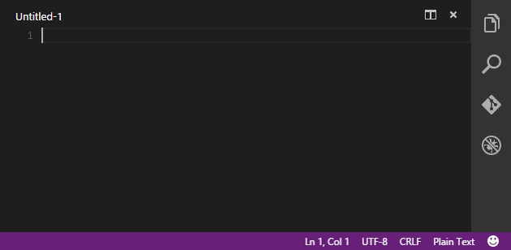

# VS Code database
### Extension for Visual Studio Code 

## Usage

## Install
* Press `Shift+Ctrl+P` 
* Pick `Extensions: Install Extension`
* Find vscode-database
 
## License
MIT © [Bajdzis](https://github.com/Bajdzis)
